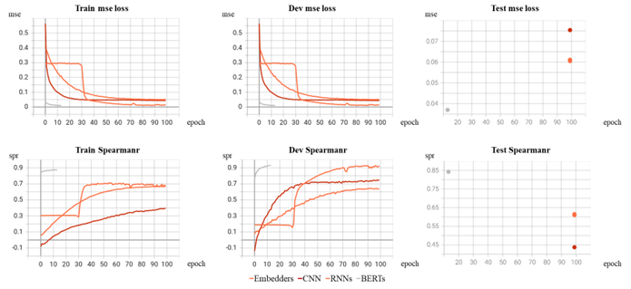

# Sentence representation

A systematically integrated toolkit on sentence embedding representation, built from scratch.

Four kinds of models are supported: 

* Embedders (GloVe, Word2Vec)

* TextCNN

* RNNs (RNN, LSTM, GRU)

* BERTs (BERT, ALBERT, RoBERTa)

## Preparation

* Git clone this repository or download and unzip Sentence-representation.zip
  
  ```bash
  git clone https://github.com/brian-zZZ/Sentence-representation.git
  ```

* Setup environment dependencies
  
  ```bash
  pip install -r requirements.txt
  ```

* Download pretrained embeddings vectors of [GloVe](https://huggingface.co/stanfordnlp/glove/resolve/main/glove.6B.zip) and [Word2Vec](https://huggingface.co/fse/word2vec-google-news-300/resolve/main/word2vec-google-news-300.model.vectors.npy), then place to `sentence-representation/glove.6B/` and `sentence-representation/word2vec/` resprectively. For Chinese users, you may also download via [Baidu NetDisk link]([百度网盘 请输入提取码](https://pan.baidu.com/s/1YzJeGvo_noLB31h7j5fiWQ?pwd=pd9m)), pass-code: pd9m.

* Download pretrained weights of BERTs of Huggingface, **Optional**. Pretrained weights are available at the Baidu NetDisk link above, place them to `sentence-representation/huggingface_pretrained/`.
  
  If you don't download the pretrained weights,  remember to pass `--local_or_online=online` when you run the `main_BERTs.py` script, then the online weights will be cached properly.

## Data-preprocessing

```bash
# Word level
python preprocessor.py --word_type=word --min_freq=1

# Subword level
python preprocessor.py --word_type=subword --min_freq=2
```

## Models training & testing

* Embedders
  
  Mainly determining args: 
  
  `embedder_type`: str, choices=[glove, word2vec]
  
  `siamese`: bool
  
  `pooling_strategy`: str, choices=[mean, max]
  
  `word_type`: str, choices=[word, subword]
  
  ```bash
  python main_Embedders.py --embedder_type=glove --siamese --pooling_strategy=mean --word_type=subword
  ```

* CNN
  
  Mainly determining args: `siamese, embedder_type, word_type`
  
  ```bash
  python main_CNN.py "your specific args config"
  ```

* RNNs
  
  Mainly determining args: `rnn_type, bidirect, siamese, embedder_type`, where the choices of `rnn_type` are `rnn, lstm, gru`
  
  ```bash
  python main_RNNs.py "your specific args config"
  ```

* BERTs
  
  Mainly determining args: `bert_type, pooling_strategy, siamese, word_type`, where the choices of `bert_type` are `bert, bert_nli, bert_simcse, albert, roberta_nli`.
  
  `_nli` variants are quoted from: [Sentence Embeddings using Siamese BERT-Networks](https://aclanthology.org/D19-1410.pdf)[1]
  
  `_simcse` variant is quoted from: [Simple Contrastive Learning of Sentence Embeddings](https://aclanthology.org/2021.emnlp-main.552.pdf)[2]
  
  ```bash
  python main_BERTs.py "your specific args config"
  ```

More args of each models please check the corresponding `main_x.py` file, and customize your training schedule.

## Performance comparison



BERTs outpeform other methods by absolute advantage, although it costs more time and hardware resources; Embedders and RNNs are not bad, close to each other; while TextCNN peforms pour, indicating it's not that suitable for sentence sementic similarity prediction.

## Infos & Acknowledgement

Author: Brian Zhang, College of AI, UCAS.

This is the programming assignment implementation for the Text Data Mining course, Spring semester, 2022 in UCAS.

This integrated toolkit on sentence embedding is welcome to use, and please cite here.

## References

[1] [Reimers, Nils and Iryna Gurevych. “Sentence-BERT: Sentence Embeddings using Siamese BERT-Networks.” *ArXiv* abs/1908.10084 (2019): n. pag.](https://aclanthology.org/D19-1410.pdf)

[2] [Gao, Tianyu, Xingcheng Yao and Danqi Chen. “SimCSE: Simple Contrastive Learning of Sentence Embeddings.” ArXiv abs/2104.08821 (2021): n. pag.](https://aclanthology.org/2021.emnlp-main.552.pdf)

[3] [Cer, Daniel Matthew, Mona T. Diab, Eneko Agirre, Iñigo Lopez-Gazpio and Lucia Specia. “SemEval-2017 Task 1: Semantic Textual Similarity Multilingual and Crosslingual Focused Evaluation.” *SemEval@ACL* (2017).](https://aclanthology.org/S17-2001.pdf)
